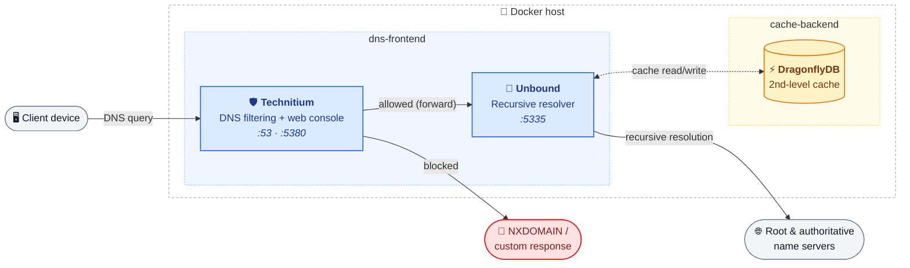

# Hygge

[](LICENSE)
[](docker/docker-compose.yml)
[](https://technitium.com/dns/)
[](https://unbound.docs.nlnetlabs.nl/en/latest/)
[](https://www.dragonflydb.io/)

A minimal, self-hosted DNS stack for your home network.

## Table of contents

- [About](#about)
- [Requirements](#requirements)
  - [Hardware](#hardware)
- [Setup](#setup)
- [Configuration](#configuration)
  - [Ports](#ports)
- [Updating](#updating)
- [Backup](#backup)
- [FAQ](#faq)
- [Credits](#credits)
- [License](#license)

## About

> *Hygge* (pronounced roughly "hoo-gah") is a Danish word for the cozy, content feeling of being at home, safe and looked after. That's the idea behind the name: a network that quietly filters out ads, trackers, and malicious domains at the DNS level is exactly the kind of unglamorous comfort that makes being home feel a little better — one less thing to worry about, running happily in the background.

Hygge is a lightweight Docker Compose stack built around three components: Technitium, Unbound, and DragonflyDB.

**Technitium** acts as the network's DNS sinkhole (comparable to Pi-hole or AdGuard Home). It answers queries from your devices, blocks domains found on its configured block-lists, and comes with a web console for managing zones, logs, and settings.

**Unbound** is a validating, recursive DNS resolver. Rather than forwarding to a third-party DNS provider, it resolves names itself, starting at the root zones and following the chain of authority down to the answer — keeping your DNS traffic away from external resolvers.

**DragonflyDB** is a high-performance, Redis-compatible in-memory store. Unbound uses it as a second-level cache, so previously resolved records survive container restarts and are shared efficiently.

Together they form a layered pipeline: Technitium filters and forwards queries, Unbound resolves and validates them, and DragonflyDB keeps the results fast to retrieve on the next lookup.



## Requirements

- Docker
- Docker Compose

### Hardware

Hygge is deliberately lightweight — this is a classic home-lab / Raspberry Pi project, not something that needs a beefy server. With the default config (`num-threads: 1` in Unbound, modest cache sizes), a few hundred MB of RAM and a single CPU core are enough for typical home network traffic.

- **CPU**: 1 core is enough for a normal household; Unbound's `num-threads` can be raised in [`unbound.conf`](docker/volumes/unbound/unbound.conf) if you have cores to spare.
- **RAM**: roughly 256–512 MB total across all three containers at idle, plus whatever you grow the cache sizes to.
- **Storage**: a few hundred MB for the container images, plus space for logs, the block list cache, and DragonflyDB's persisted cache data.
- **Architecture**: Technitium and the Unbound image publish multi-arch builds including `arm64`, so a 64-bit Raspberry Pi (3/4/5) works well. DragonflyDB's ARM support has historically been newer/less battle-tested than its `amd64` builds — if you're deploying on ARM, check that the `docker.dragonflydb.io/dragonflydb/dragonfly:latest` tag you're pulling actually has an `arm64` manifest before relying on it.

## Setup

1. Clone the repository:

   ```sh
   git clone https://github.com/Hope-IT-Works/Hygge.git
   cd Hygge
   ```

2. Copy the environment template and adjust the values for your host:

   ```sh
   cd docker
   cp .env.example .env
   ```

3. **Set an admin password before the first start.** Technitium only reads `DNS_SERVER_ADMIN_PASSWORD` (or `DNS_SERVER_ADMIN_PASSWORD_FILE`) while initializing its config for the very first time. Leaving it unset means Technitium creates the initial admin account with the well-known default password `admin` — a real security risk on a network-facing DNS service. Uncomment and set it in `.env`:

   ```env
   DNS_SERVER_ADMIN_PASSWORD=<your-strong-password>
   ```

   Note that setting this later has no effect once a config already exists under `./volumes/technitium/config`. In that case, change the password from the web console instead.

4. Start the stack:

   ```sh
   docker compose up -d
   ```

5. Open the Technitium web console at `http://<your-docker-host>:5380` and confirm you can log in with the admin password you configured.

## Configuration

All configurable options are documented in [`docker/.env.example`](docker/.env.example) — copy it to `.env` and uncomment what you need (see [Setup](#setup)). It covers Technitium's admin credentials, IPv6 preference, web console settings, recursion/blocking behavior, forwarders, logging, and Single Sign-On, among others. Unbound's own settings live in [`docker/volumes/unbound/unbound.conf`](docker/volumes/unbound/unbound.conf) and the snippets under `docker/volumes/unbound/unbound.conf.d/`.

### Ports

Only Technitium exposes ports on the host; Unbound and DragonflyDB are only reachable from within the Docker network.

| Port         | Protocol  | Service    | Purpose                    |
| ------------ | --------- | ---------- | --------------------------- |
| `53`         | TCP + UDP | Technitium | DNS queries                 |
| `5380`       | TCP       | Technitium | Web console / HTTP API (configurable via `DNS_SERVER_WEB_SERVICE_HTTP_PORT` in `.env`) |

## Updating

1. Pull the latest changes from the repository:

   ```sh
   git pull
   ```

2. Pull the latest container images:

   ```sh
   cd docker
   docker compose pull
   ```

3. Recreate the containers with the new images:

   ```sh
   docker compose up -d
   ```

4. Confirm everything came back up healthy, then clean up old, now-unused images:

   ```sh
   docker compose ps
   docker image prune -f
   ```

## Backup

All of Technitium's state (zones, allowed/blocked lists, block list cache, DHCP scopes, settings, and users) lives under `docker/volumes/technitium/config`. This is what a config reset (see the [FAQ](#faq)) wipes, so back it up before you rely on this stack for real.

**Option 1 — copy the folder.** Simplest approach, works offline:

```sh
cd docker
docker compose stop technitium
cp -r volumes/technitium/config /path/to/backup/technitium-config-$(date +%F)
docker compose start technitium
```

**Option 2 — Technitium's built-in backup API.** Exports a ZIP without stopping the server, and can be restored again from the same API:

```sh
# Log in once to get a session token
TOKEN=$(curl -s "http://<your-docker-host>:5380/api/user/login?user=admin&pass=<your-password>" | jq -r .token)

# Download a backup of everything that matters
curl -o hygge-backup.zip \
  -H "Authorization: Bearer $TOKEN" \
  "http://<your-docker-host>:5380/api/settings/backup?dnsSettings=true&logSettings=true&zones=true&allowedZones=true&blockedZones=true&blockLists=true&scopes=true&apps=true"
```

Restore it later with the equivalent `/api/settings/restore` call (multi-part upload of the ZIP) — see the [APIDOCS.md backup/restore section](https://github.com/TechnitiumSoftware/DnsServer/blob/master/APIDOCS.md#backup-settings) for the full parameter list.

DragonflyDB isn't worth backing up — it's only a cache. Losing it just means Unbound starts with a cold cache after the next restart, nothing is lost permanently.

## FAQ

<details>
<summary>What do I actually get out of running Hygge?</summary>

Network-wide ad, tracker, and malware blocking at the DNS level (via Technitium and its block lists), private recursive DNS resolution that doesn't depend on a third-party resolver like Google or Cloudflare (via Unbound, which talks to the authoritative name servers itself), DNSSEC validation to guard against spoofed responses, and faster repeat lookups thanks to the DragonflyDB-backed cache — all self-hosted, running on hardware you control.

</details>

<details>
<summary>How do I set up my devices to use it?</summary>

See [CLIENTS.md](CLIENTS.md) for quick, copy-pasteable instructions covering the router/DHCP (recommended, covers your whole network at once), Windows, macOS, Linux, Android, and iOS.

</details>

<details>
<summary>Is DNSSEC validated?</summary>

Yes. Unbound validates DNSSEC on every recursively resolved answer (`harden-dnssec-stripped`, `harden-below-nxdomain`, `harden-referral-path` are all enabled in [`unbound.conf`](docker/volumes/unbound/unbound.conf)). Technitium also has its own `dnssecValidation` setting for responses coming from its forwarder; leaving it enabled just re-validates what Unbound already validated, which is redundant but harmless.

</details>

<details>
<summary>How do I add more block lists?</summary>

`DNS_SERVER_BLOCK_LIST_URLS` in `.env` only applies on the very first start, before Technitium has a config yet (see [Setup](#setup)). For an already-running instance, add URLs from the web console under **Settings → Blocking → Block List URLs**, or via the [`/api/settings/set`](https://github.com/TechnitiumSoftware/DnsServer/blob/master/APIDOCS.md#set-dns-settings) API call with a comma-separated `blockListUrls` parameter.

</details>

<details>
<summary>A site is wrongly blocked — how do I allow it?</summary>

Add the domain to the **Allowed** zone from the web console (or `/api/allowed/add`). This overrides the block lists for that domain without having to remove or edit a whole list.

</details>

<details>
<summary>How do I clear the DNS cache?</summary>

Technitium's own cache: web console → **Cache** → *Flush Cache* (or `/api/cache/flush`). Unbound's second-level cache in DragonflyDB is separate and isn't cleared by that; run `docker exec hygge-dragonfly redis-cli FLUSHDB` to empty it as well.

</details>

<details>
<summary>How do I verify Unbound is actually using DragonflyDB as a cache?</summary>

Compare `docker exec hygge-dragonfly redis-cli DBSIZE` before and after resolving a domain that hasn't been queried before — the key count should increase. See the [cachedb.conf](docker/volumes/unbound/unbound.conf.d/cachedb.conf) comments for how the connection is configured.

</details>

<details>
<summary>Why does `DNS_SERVER_FORWARDERS` show an IP address instead of `unbound`?</summary>

Technitium resolves forwarder addresses with its own internal DNS client rather than the container's OS/Docker resolver, and since Unbound is its only forwarder it has no other resolver to look up a plain hostname with. [`scripts/technitium-entrypoint.sh`](docker/scripts/technitium-entrypoint.sh) resolves Unbound's current IP via the container's OS resolver at every start and passes it in, so no IP has to be hardcoded.

</details>

<details>
<summary>I changed the forwarder/network setup and DNS resolution broke again — why?</summary>

Like all `DNS_SERVER_*` variables, this only applies on Technitium's very first start. If a `dns.config` already exists under `./volumes/technitium/config`, environment changes are ignored. Either update the forwarder from the web console under **Settings → Dns**, or reset `./volumes/technitium/config` for a clean first boot (this wipes all other Technitium settings too).

</details>

<details>
<summary>Can I reach Unbound or DragonflyDB directly from the host?</summary>

No, by design — neither publishes a host port; only Technitium's DNS and web console ports are exposed (see [Ports](#ports)). Use `docker exec` into the respective container for debugging (e.g. `unbound-control` for Unbound, `redis-cli` for DragonflyDB).

</details>

<details>
<summary>Where do I find the logs?</summary>

- **Technitium**: written to files under [`docker/volumes/technitium/logs`](docker/volumes/technitium/logs) (one file per day, e.g. `2026-07-30.log`), and also browsable from the web console under **Logs**. Retention is controlled by `DNS_SERVER_LOG_MAX_LOG_FILE_DAYS` in `.env` (first-boot only — change it from the web console under **Settings → Logging** afterwards). Per-query logging can be toggled there too (`DNS_SERVER_LOG_USING_LOCAL_TIME` / query logs), which is verbose and costs some performance.
- **Unbound**: logs to the container's stdout only (`logfile: ""`), at `verbosity: 0` (errors only) by default — view it with `docker logs hygge-unbound`. Bump `verbosity` in [`unbound.conf`](docker/volumes/unbound/unbound.conf) temporarily for troubleshooting; we intentionally don't enable per-query logging here since nothing in this stack consumes it and it would just add overhead (see the `unbound.conf.d` comments for context).
- **DragonflyDB**: `docker logs hygge-dragonfly`.
- All three at once: `docker compose logs -f` from the `docker/` folder.

</details>

## Credits

Hygge is just glue around the excellent work of others:

- **Technitium DNS Server** — the DNS filtering server and web console.\
  Website: <https://technitium.com/dns/> · GitHub: <https://github.com/TechnitiumSoftware/DnsServer>
- **Unbound** by NLnet Labs — the recursive, validating resolver.\
  Website: <https://unbound.docs.nlnetlabs.nl/en/latest/> · GitHub: <https://github.com/NLnetLabs/unbound>
  - Run here via the **klutchell/docker-unbound** image.\
    GitHub: <https://github.com/klutchell/docker-unbound>
- **DragonflyDB** — the Redis-compatible in-memory store used as Unbound's second-level cache.\
  Website: <https://www.dragonflydb.io/> · GitHub: <https://github.com/dragonflydb/dragonfly>
- **StevenBlack/hosts** — the default block list used out of the box.\
  GitHub: <https://github.com/StevenBlack/hosts>

## License

This project is licensed under the [MIT License](LICENSE).

